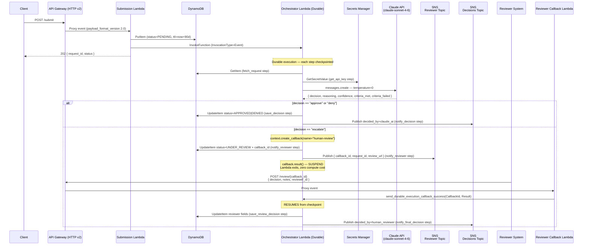

# CareFlow Prior Authorization Engine

AI-powered prior authorization automation using **AWS Lambda Durable Functions** and **Anthropic Claude** (`claude-sonnet-4-6`). Requests are evaluated instantly by AI, auto-approved/denied, or escalated to human review at zero compute cost while the orchestrator is suspended.

## Architecture



## Decision Log

### Lambda Durable Functions vs AWS Step Functions

| Factor | Lambda Durable Functions | Step Functions |
|---|---|---|
| Code model | Pure Python, natural control flow | Amazon States Language (ASL) JSON/YAML |
| Human-in-the-loop | Built-in `create_callback()` + `callback.result()` | `waitForTaskToken` pattern |
| Compute cost during wait | **Zero** — Lambda exits while suspended | Standard Workflows bill per state transition + duration |
| Developer experience | All orchestration logic in one Python file | Separate state machine definition file |
| Debugging | Single Lambda log group per execution | Visual console but separate execution model |
| Execution duration | Up to 1 year (P365D) | Up to 1 year (Standard) |

**Chosen: Lambda Durable Functions** — natural Python control flow, built-in zero-cost callback suspension, and all orchestration colocated with business logic in a single Python file. No workflow DSL to maintain.

---

### Claude API (Direct) vs Amazon Bedrock

| Factor | Claude API Direct | Amazon Bedrock |
|---|---|---|
| Model availability | Same-day access to `claude-sonnet-4-6` | Subject to Bedrock's release schedule |
| API surface | Full Anthropic API (system prompt, temperature, content blocks) | Bedrock converse API — different request/response shape |
| Authentication | API key in Secrets Manager | AWS IAM / SigV4 signing |
| SDK | `anthropic` Python package — clean, typed | `boto3` `bedrock-runtime` — verbose |
| Pricing | Direct Anthropic pricing ($3/$15 per MTok in/out) | AWS markup added on top |
| Compliance | API key rotation via Secrets Manager | Native IAM + VPC endpoint options |

**Chosen: Claude API direct** — guaranteed access to `claude-sonnet-4-6` with same-day model parity, the cleaner `anthropic` SDK, and the API key secured in AWS Secrets Manager.

---

## API Reference

### `POST /submit`

Submit a prior authorization request for evaluation.

**Request body:**
```json
{
  "patient_id": "PAT-001",
  "provider_id": "PROV-001",
  "diagnosis_code": "J18.9",
  "procedure_code": "99233"
}
```

**Response `202`:**
```json
{
  "request_id": "550e8400-e29b-41d4-a716-446655440000",
  "status": "PENDING",
  "message": "Prior authorization request received and processing initiated"
}
```

**Error `400`:**
```json
{
  "error": "Validation failed",
  "details": ["Missing required field: diagnosis_code"]
}
```

---

### `GET /status/{request_id}`

Check the status of a prior authorization request. Returns only status and AI decision metadata — no clinical detail or PII.

**Response `200`:**
```json
{
  "request_id": "550e8400-e29b-41d4-a716-446655440000",
  "status": "APPROVED",
  "ai_decision": "approve",
  "ai_confidence": "0.95",
  "submitted_at": "2026-06-25T00:27:36+00:00",
  "resolved_at": "2026-06-25T00:30:12+00:00"
}
```

Fields returned when present:

| Field | When present |
|---|---|
| `request_id` | Always |
| `status` | Always (`PENDING` / `APPROVED` / `DENIED` / `UNDER_REVIEW`) |
| `ai_decision` | After Claude evaluation (`approve` / `deny` / `escalate`) |
| `ai_confidence` | After Claude evaluation |
| `submitted_at` | Always |
| `resolved_at` | Only when `status` is `APPROVED` or `DENIED` |
| `human_reviewer` | Only when resolved by a human reviewer |

**Error `404`:** `request_id` not found.  
**Error `400`:** `request_id` path parameter missing.

---

### `POST /review/{callback_id}`

Submit a human reviewer decision for an escalated request. `callback_id` is retrieved from DynamoDB or the SNS reviewer notification.

**Request body:**
```json
{
  "decision": "approved",
  "notes": "Reviewed by oncology specialist. Procedure is medically necessary for stage II NSCLC.",
  "reviewer_id": "DR-JONES-007"
}
```

**Response `200`:**
```json
{
  "message": "Review decision recorded and orchestration resumed",
  "callback_id": "cb-...",
  "decision": "approved"
}
```

**Error `404`:** Callback already resolved or expired.  
**Error `400`:** `decision` must be `"approved"` or `"denied"`.

---

## Quick Start

### Prerequisites

- AWS CLI configured with appropriate permissions
- Terraform >= 1.5.0
- Python 3.13
- An Anthropic API key

### Build & Deploy

```bash
# 1. Build Lambda packages
./scripts/build.sh

# 2. Deploy infrastructure
cd terraform
terraform init
terraform plan -var="anthropic_api_key=sk-ant-..." -out=tfplan
terraform apply tfplan

# 3. Get API URL
export API_URL=$(terraform output -raw api_gateway_url)
echo "API URL: $API_URL"
```

### Test — Automated Decision

```bash
# Submit a request
RESPONSE=$(curl -s -X POST "$API_URL/submit" \
  -H "Content-Type: application/json" \
  -d '{"patient_id":"PAT-001","provider_id":"PROV-001","diagnosis_code":"J18.9","procedure_code":"99233"}')

REQUEST_ID=$(echo "$RESPONSE" | python3 -c "import sys,json; print(json.load(sys.stdin)['request_id'])")
echo "Request ID: $REQUEST_ID"

# Wait for Claude evaluation (~10-20 seconds)
sleep 20

# Check status via API
curl -s "$API_URL/status/$REQUEST_ID" | python3 -m json.tool
```

### Test — Escalation + Human Review

```bash
# Submit a request that Claude will escalate (unusual procedure)
ESCALATION=$(curl -s -X POST "$API_URL/submit" \
  -H "Content-Type: application/json" \
  -d '{"patient_id":"PAT-002","provider_id":"PROV-002","diagnosis_code":"C34.12","procedure_code":"0DBW0ZZ"}')

ESC_ID=$(echo "$ESCALATION" | python3 -c "import sys,json; print(json.load(sys.stdin)['request_id'])")

sleep 20

# Get callback_id from DynamoDB
CALLBACK_ID=$(aws dynamodb get-item \
  --table-name careflow-prior-auth-requests \
  --key "{\"request_id\":{\"S\":\"$ESC_ID\"}}" \
  --query 'Item.callback_id.S' --output text)

echo "Callback ID: $CALLBACK_ID"

# Submit reviewer decision — this resumes the suspended orchestrator
curl -s -X POST "$API_URL/review/$CALLBACK_ID" \
  -H "Content-Type: application/json" \
  -d '{"decision":"approved","notes":"Specialty review confirms medical necessity.","reviewer_id":"DR-SMITH-001"}'

sleep 10

# Verify final state via API
curl -s "$API_URL/status/$ESC_ID" | python3 -m json.tool
```

---

## Project Structure

```
careflow-prior-auth/
├── CLAUDE.md                          # Full project spec and SDK usage guide
├── scripts/
│   └── build.sh                       # Packages Lambdas into deployment zips
├── src/
│   ├── orchestrator/
│   │   ├── handler.py                 # @durable_execution — Claude eval + callback
│   │   └── requirements.txt
│   ├── submission/
│   │   ├── handler.py                 # Standard Lambda — API Gateway entry point
│   │   └── requirements.txt
│   ├── reviewer_callback/
│   │   ├── handler.py                 # Standard Lambda — resolves durable callback
│   │   └── requirements.txt
│   └── status/
│       ├── handler.py                 # Standard Lambda — GET /status/{request_id}
│       └── requirements.txt
└── terraform/
    ├── main.tf                        # Provider, backend, locals
    ├── variables.tf                   # aws_region, environment, anthropic_api_key
    ├── outputs.tf                     # API URL, Lambda ARNs, SNS ARNs
    ├── dynamodb.tf                    # PAY_PER_REQUEST table with TTL
    ├── sns.tf                         # Reviewer + decisions topics
    ├── lambda.tf                      # 4 Lambdas, orchestrator has durable_config
    ├── iam.tf                         # Least-privilege roles + Secrets Manager secret
    └── api_gateway.tf                 # HTTP API v2, routes, integrations
```