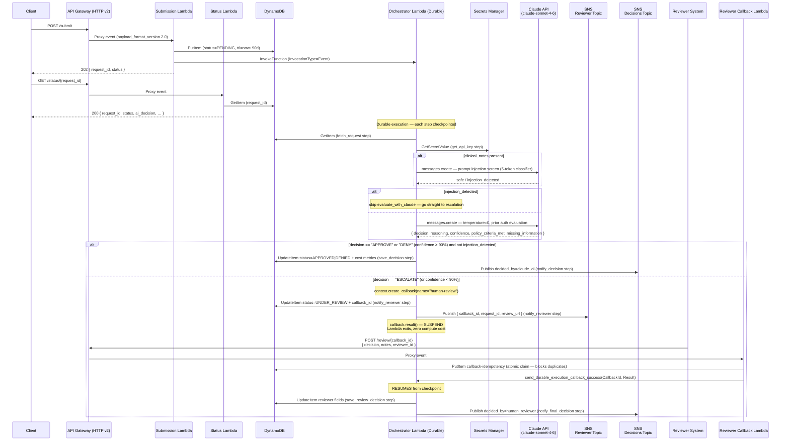

# CareFlow Prior Authorization Engine

> Routine prior authorizations decided in under 30 seconds. Complex cases routed to a human reviewer immediately — not after three days in a fax queue.

---

## The Problem: Prior Authorization Is Broken

Before a doctor can perform many procedures, prescribe certain medications, or refer a patient to a specialist, they need approval from the patient's insurance company. This is called prior authorization.

In theory, it protects against unnecessary care. In practice, it has become one of the largest sources of friction in the American healthcare system.

**What a prior authorization looks like today:**

A patient is diagnosed with pneumonia. Their doctor determines they need a particular antibiotic. Before prescribing it, the office must submit a prior authorization request to the insurer. The insurer assigns it to a reviewer queue. The doctor's office calls to follow up. The insurer requests additional documentation. The office faxes it. The insurer re-queues it. Three to seven business days later — if no further information is requested — the patient gets an answer.

During that window, the patient's condition can worsen. The doctor's office has spent 20–30 minutes of staff time per request on calls, fax submissions, and follow-ups, for a decision that in most cases will be approved anyway. Multiply that across thousands of requests per month and the administrative burden becomes enormous.

According to the American Medical Association, 94% of physicians report that prior authorization delays access to necessary care. One in four patients abandons treatment entirely while waiting. Hospitals and clinics employ entire teams of people whose only job is to navigate this process.

The current system was designed for a world of paper faxes. It hasn't fundamentally changed.

**The cost of doing nothing:** delayed treatment for patients who need it now, a growing administrative burden that pulls clinical staff away from patient care, and a process where the outcome is the same whether a case takes three hours or three days to reach a human reviewer.

---

## The Solution

CareFlow automates the decision for straightforward cases and accelerates the path to human review for everything else.

When a prior authorization request arrives, CareFlow evaluates it against clinical criteria in real time. If the diagnosis and procedure combination is a clear standard-of-care match — the kind a human reviewer would approve in two minutes — CareFlow approves it in under 30 seconds. If the case is ambiguous, unusual, or high-risk, CareFlow doesn't guess. It immediately routes the request to a human reviewer with all the context already prepared: the patient details, the clinical information, a direct link to submit their decision.

The framing matters: **this is not "AI replacing doctors."** It is automating the easy 80% of decisions so that human experts spend their time on the 20% that genuinely requires their judgment.

---

## Before and After

| | Before | After |
|---|---|---|
| **Routine approvals** | 3–7 business days, regardless of complexity | Under 30 seconds |
| **Complex cases** | Sit in the same queue as routine ones | Reach a human reviewer immediately, with context pre-prepared |
| **Doctor's office** | Repeated calls and fax follow-ups | Single submission via API |
| **Patient experience** | Days of uncertainty, sometimes treatment abandonment | Near-instant answer for straightforward cases |
| **Audit trail** | Paper records, inconsistent documentation | Every decision — AI or human — is logged with full reasoning |

---

## Why This Makes Financial Sense

Every AI evaluation in CareFlow costs a fraction of a cent. In live testing, a full prior authorization evaluation — fetching the request, checking for manipulation, evaluating the case against clinical criteria, and recording the decision — costs **$0.008865 per request** in AI inference fees, tracked automatically per decision.

For context, the industry estimate for processing a single prior authorization on the provider side is $11–$14 in staff time (CAQH, 2023). For cases CareFlow can decide automatically, that cost drops to under a penny.

Every decision is tracked in real time with CloudWatch metrics broken down by decision type. A hospital finance team can model the unit economics directly: volume × cost per decision × approval rate, rather than estimating staff hours.

This also makes the economics of the escalation path clear. When CareFlow routes a case to a human reviewer, that human is spending time on a case that genuinely needs them — not on paperwork for a routine approval. The reviewer's time has a higher return.

---

## Why Trust Matters More Than Speed

Speed is the obvious benefit. It is not the differentiating one.

An AI system that makes fast decisions is only valuable if those decisions are trustworthy. In healthcare prior authorization, a wrong decision has real consequences: a patient doesn't get treatment they need, or a hospital faces a denied claim they then have to appeal. A system that is fast but unreliable is worse than the slow manual process it replaced.

CareFlow is built around three trust mechanisms, described here in plain terms:

### The AI only decides when it's confident enough

Every CareFlow evaluation produces a confidence score alongside the decision. If the AI recommends approval or denial but its confidence falls below 90%, the system automatically escalates to a human reviewer instead — regardless of what the AI recommended.

This means the system never forces a decision on a borderline case. The 90% threshold is a hard rule: a case that the AI is 89% sure about goes to a human. No exceptions, no overrides.

### Clinical notes are screened before the AI reads them

Prior authorization requests can include free-text clinical notes from the provider. These notes go through a separate screening step before the main evaluation — the system checks whether the notes contain anything that looks like an attempt to manipulate the AI's decision rather than genuine clinical information.

If the screening flags anything suspicious, the request bypasses the AI evaluation entirely and goes straight to human review. The AI never sees content that might bias it.

### Duplicate reviewer submissions can't corrupt a patient's record

When a human reviewer submits their decision, the system records it atomically — in a single database operation that either succeeds completely or doesn't happen at all. If the same reviewer accidentally submits twice, or two reviewers both try to resolve the same case, the second submission is rejected with a clear error. The patient's authorization record reflects exactly one decision, from exactly one reviewer.

---

## How It Works

*The rest of this README is the technical implementation for engineers and reviewers who want to go deeper.*

### Architecture


| Component | Technology | Purpose |
|---|---|---|
| Submission Lambda | Python 3.13 | API entry point, persists request to database |
| Orchestrator Lambda | Python 3.13, AWS Lambda Durable Functions, Anthropic SDK | Stateful evaluation workflow — runs Claude, suspends at zero cost while waiting for a human |
| Status Lambda | Python 3.13 | Read-through API for checking request status |
| Reviewer Callback Lambda | Python 3.13 | Receives human decisions, resumes the suspended orchestrator |
| API Gateway | HTTP API v2 | Three public endpoints |
| DynamoDB | `careflow-prior-auth-requests` | Request state, 90-day TTL |
| DynamoDB | `careflow-{env}-callback-idempotency` | Prevents duplicate callback resolution |
| SNS | `careflow-{env}-reviewer-notifications` | Notifies human reviewers when a case is escalated |
| SNS | `careflow-{env}-decision-notifications` | Publishes final decisions for downstream systems |
| Secrets Manager | `careflow/anthropic-api-key` | API key, never in environment variables or code |
| CloudWatch | `CareFlow` namespace | Per-decision token cost metrics |

### Orchestration Flow



### Security

- **API key** stored in AWS Secrets Manager, fetched at runtime inside a durable step — never in environment variables or Lambda configuration
- **Prompt injection screening** runs before every evaluation that includes clinical notes — a separate 5-token Claude call classifies the notes as clinical content or instruction injection before the main evaluation begins
- **Idempotent callbacks** — the reviewer callback uses a conditional `PutItem` (`attribute_not_exists(callback_id)`) on a dedicated table to atomically claim each callback ID, making duplicate submissions a 409 rather than a data corruption event
- **Confidence threshold** — 90% minimum; below that, APPROVE or DENY recommendations are overridden to ESCALATE regardless of Claude's stated preference
- **Schema validation** — Claude's response is validated against a strict Pydantic schema before any action is taken; a malformed or unparseable response triggers an immediate escalation rather than a bad decision
- **IAM least privilege** — each Lambda has its own role scoped to exactly the resources it touches; no shared roles

---

## Engineering Decisions

### Lambda Durable Functions vs AWS Step Functions

| Factor | Lambda Durable Functions | Step Functions |
|---|---|---|
| Code model | Pure Python, natural control flow | Amazon States Language (ASL) JSON/YAML |
| Human-in-the-loop | Built-in `create_callback()` + `callback.result()` | `waitForTaskToken` pattern |
| Compute cost during wait | **Zero** — Lambda exits while suspended | Standard Workflows bill per state transition + duration |
| Developer experience | All orchestration logic in one Python file | Separate state machine definition file |
| Debugging | Single Lambda log group per execution | Visual console but separate execution model |
| Execution duration | Configurable; **30 days** in this project (`execution_timeout=2592000`) | Up to 1 year (Standard) |

**Chosen: Lambda Durable Functions.** The suspended orchestrator costs nothing while waiting for a human reviewer — which could be hours or days. Step Functions would bill for that entire wait. For a workflow where human review is a core path, not an edge case, the cost difference is meaningful. The Python control flow also keeps all business logic in one file: no workflow DSL to learn or maintain separately.

*Business reason:* A hospital processing thousands of escalations per month cannot have infrastructure costs that scale with reviewer response time. Zero-cost suspension makes the economics predictable regardless of how long humans take.

### Claude API (Direct) vs Amazon Bedrock

| Factor | Claude API Direct | Amazon Bedrock |
|---|---|---|
| Model availability | Same-day access to `claude-sonnet-4-6` | Subject to Bedrock's release schedule |
| API surface | Full Anthropic API (system prompt, temperature, content blocks) | Bedrock converse API — different request/response shape |
| Authentication | API key in Secrets Manager | AWS IAM / SigV4 signing |
| SDK | `anthropic` Python package — clean, typed | `boto3` `bedrock-runtime` — verbose |
| Pricing | Direct Anthropic pricing ($3/$15 per MTok in/out) | AWS markup added on top |

**Chosen: Claude API direct.** `claude-sonnet-4-6` access on day of release, the cleaner `anthropic` SDK, and lower per-token cost. The API key is secured in AWS Secrets Manager — the compliance argument for Bedrock's native IAM is addressed.

*Business reason:* In healthcare AI, model quality directly affects decision accuracy. Running the latest model without waiting for a cloud provider's release cycle means clinical criteria evaluations use the most capable available reasoning.

---

## API Reference

### `POST /submit`

Submit a prior authorization request for evaluation.

**Request body:**
```json
{
  "patient_id": "PAT-001",
  "provider_id": "PROV-001",
  "diagnosis_code": "J18.9",
  "procedure_code": "99233",
  "clinical_notes": "Optional free-text clinical context"
}
```

**Response `202`:**
```json
{
  "request_id": "550e8400-e29b-41d4-a716-446655440000",
  "status": "PENDING",
  "message": "Prior authorization request received and processing initiated"
}
```

**Error `400`:**
```json
{
  "error": "Validation failed",
  "details": ["Missing required field: diagnosis_code"]
}
```

---

### `GET /status/{request_id}`

Check the status of a prior authorization request. Returns status and AI decision metadata — no clinical detail or PII.

**Response `200`:**
```json
{
  "request_id": "550e8400-e29b-41d4-a716-446655440000",
  "status": "APPROVED",
  "final_decision": "APPROVE",
  "ai_decision": "approve",
  "ai_confidence": "0.95",
  "submitted_at": "2026-06-25T00:27:36+00:00",
  "resolved_at": "2026-06-25T00:30:12+00:00"
}
```

| Field | When present |
|---|---|
| `request_id` | Always |
| `status` | Always (`PENDING` / `APPROVED` / `DENIED` / `UNDER_REVIEW`) |
| `ai_decision` | After Claude evaluation (`approve` / `deny` / `escalate`) |
| `ai_confidence` | After Claude evaluation |
| `submitted_at` | Always |
| `resolved_at` | When `status` is `APPROVED` or `DENIED` |
| `human_reviewer` | When resolved by a human reviewer |

**Error `404`:** `request_id` not found.  
**Error `400`:** `request_id` path parameter missing.

---

### `POST /review/{callback_id}`

Submit a human reviewer decision for an escalated request. `callback_id` is included in the SNS reviewer notification and available via DynamoDB.

**Request body:**
```json
{
  "decision": "approved",
  "notes": "Reviewed by oncology specialist. Procedure is medically necessary for stage II NSCLC.",
  "reviewer_id": "DR-JONES-007"
}
```

**Response `200`:**
```json
{
  "message": "Review decision recorded and orchestration resumed",
  "callback_id": "cb-...",
  "decision": "approved"
}
```

**Error `409`:** Callback already resolved — duplicate submission blocked.  
**Error `404`:** Callback not found or expired.  
**Error `400`:** `decision` must be `"approved"` or `"denied"`.

---

## Quick Start

### Prerequisites

- AWS CLI configured with appropriate permissions
- Terraform >= 1.5.0
- Python 3.13
- An Anthropic API key

### Build & Deploy

```bash
# 1. Build Lambda packages
./scripts/build.sh

# 2. Deploy infrastructure
cd terraform
terraform init -backend-config=backends/dev.hcl
terraform plan -var="anthropic_api_key=sk-ant-..." -out=tfplan
terraform apply tfplan

# 3. Get API URL
export API_URL=$(terraform output -raw api_gateway_url)
echo "API URL: $API_URL"
```

### Test — Automated Decision

```bash
# Submit a request (community-acquired pneumonia + hospital observation code)
RESPONSE=$(curl -s -X POST "$API_URL/submit" \
  -H "Content-Type: application/json" \
  -d '{"patient_id":"PAT-001","provider_id":"PROV-001","diagnosis_code":"J18.9","procedure_code":"99233"}')

REQUEST_ID=$(echo "$RESPONSE" | python3 -c "import sys,json; print(json.load(sys.stdin)['request_id'])")
echo "Request ID: $REQUEST_ID"

# Wait for Claude evaluation (~10-20 seconds)
sleep 20

# Check status via API
curl -s "$API_URL/status/$REQUEST_ID" | python3 -m json.tool
```

Expected result:
```json
{
  "request_id": "550e8400-e29b-41d4-a716-446655440000",
  "status": "APPROVED",
  "final_decision": "APPROVE",
  "ai_decision": "approve",
  "ai_confidence": "0.97",
  "submitted_at": "2026-06-25T00:27:36+00:00",
  "resolved_at": "2026-06-25T00:27:54+00:00"
}
```

### Test — Escalation + Human Review

```bash
# Submit a request Claude will escalate (rare lung procedure — low confidence expected)
ESCALATION=$(curl -s -X POST "$API_URL/submit" \
  -H "Content-Type: application/json" \
  -d '{"patient_id":"PAT-002","provider_id":"PROV-002","diagnosis_code":"C34.12","procedure_code":"0DBW0ZZ"}')

ESC_ID=$(echo "$ESCALATION" | python3 -c "import sys,json; print(json.load(sys.stdin)['request_id'])")

sleep 20

# Get the callback_id from DynamoDB (also included in the SNS reviewer notification)
CALLBACK_ID=$(aws dynamodb get-item \
  --table-name careflow-prior-auth-requests \
  --key "{\"request_id\":{\"S\":\"$ESC_ID\"}}" \
  --query 'Item.callback_id.S' --output text)

echo "Callback ID: $CALLBACK_ID"

# Submit reviewer decision — resumes the suspended orchestrator instantly
curl -s -X POST "$API_URL/review/$CALLBACK_ID" \
  -H "Content-Type: application/json" \
  -d '{"decision":"approved","notes":"Specialty review confirms medical necessity.","reviewer_id":"DR-SMITH-001"}'

sleep 5

# Verify final state
curl -s "$API_URL/status/$ESC_ID" | python3 -m json.tool
```

Expected result:
```json
{
  "request_id": "661f9511-f30c-52e5-b827-557766551111",
  "status": "APPROVED",
  "final_decision": "APPROVED",
  "ai_decision": "escalate",
  "submitted_at": "2026-06-25T00:31:10+00:00",
  "resolved_at": "2026-06-25T00:34:22+00:00",
  "human_reviewer": "DR-SMITH-001"
}
```

---

## Project Structure

```
careflow-prior-auth/
├── CLAUDE.md                          # Full project spec and SDK usage guide
├── docs/
│   └── careflow-architecture.drawio   # Architecture diagram (all components and connections)
├── scripts/
│   └── build.sh                       # Packages Lambdas into deployment zips
├── src/
│   ├── orchestrator/
│   │   ├── handler.py                 # @durable_execution — prompt injection screen, Claude eval, callback
│   │   └── requirements.txt
│   ├── submission/
│   │   ├── handler.py                 # Standard Lambda — API Gateway entry point
│   │   └── requirements.txt
│   ├── reviewer_callback/
│   │   ├── handler.py                 # Standard Lambda — atomic idempotency claim, resolves durable callback
│   │   └── requirements.txt
│   └── status/
│       ├── handler.py                 # Standard Lambda — GET /status/{request_id}
│       └── requirements.txt
└── terraform/
    ├── main.tf                        # Provider, backend, locals
    ├── variables.tf                   # aws_region, environment, anthropic_api_key
    ├── outputs.tf                     # API URL, Lambda ARNs, SNS ARNs
    ├── dynamodb.tf                    # Requests table (PAY_PER_REQUEST, TTL) + idempotency table
    ├── sns.tf                         # Reviewer + decisions topics
    ├── lambda.tf                      # 4 Lambdas — orchestrator has durable_config (30-day suspension)
    ├── iam.tf                         # Least-privilege roles per Lambda + Secrets Manager secret
    └── api_gateway.tf                 # HTTP API v2, 3 routes, Lambda integrations
```
